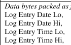
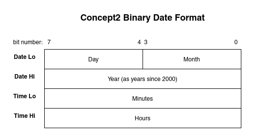
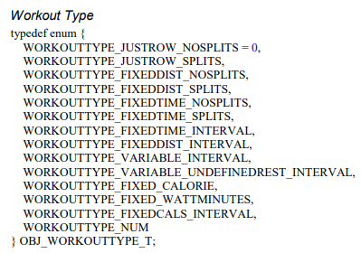

# Concept2: The Missing Specification
Author: Adrian Edwards

12/11/2021 v0.1

## Document Purpose
This is a document to explain all the things that I have discovered that appear/feel missing/undocumented/incomplete about the concept2 spec documents.

These things might help save time for others who may be following the same path

## Related/Referenced Documents
- [Concept2 Performance Monitor Bluetooth Smart Communications Interface Definition rev 1.27](https://www.concept2.com/files/pdf/us/monitors/PM5_BluetoothSmartInterfaceDefinition.pdf)

- [Concept2 Communications Interface Definition rev 0.19](https://github.com/droogmic/Py3Row/blob/master/docs/Concept2PMCommInterfaceDef.pdf)
  - This can also be found in the Concept2 SDK

## Specification

### Date and Time formats
The date and time values don't include any mention of how to parse the actual dates and times out of it.

Upon some investigation, it seems like the data in these 4 date/time bytes is represented in the following way:

### Workout Summary Characteristics

#### When are they sent
Workout summaries for "Just row" pieces are only sent if the piece is more than a minute long.

In the same way that ergs wont save "Just row" workouts that are under a minute long, the "after workout summary" data is only sent by the erg after the end of a programmed workout (intervals, distance .etc) or a just row piece that is longer than a minute.

#### How often are they sent?
TBR - I suspect that only one of each is sent, but I suspect the second characteristic will be sent multiple times for variable interval workouts to convey all the intervals.

### Workout Types

The "workout type" enum values contain a somewhat unexplainable value at the end: WORKOUTTYPE_NUM.

Current best suspicion is that this is for a Numbered workout - i.e. one being run via tne ErgRace/VenueRace application from a PC, but this is still TBR/needs confirmation.

### CSAFE Commands
The Bluetooth spec has a control service with characteristics for sending and receiving [CSAFE commands](https://en.wikipedia.org/wiki/Communications_Specification_for_Fitness_Equipment), however there is very little mention of these commands in the document.

CSAFE commands are documented more in depth in the document called `Concept2 PM Communications Interface Definition.doc` in the "Related documents" section above.

It appears as though CSAFE is a protocol that was developed by what seems to be a fitness industry association.

While the more general CSAFE spec doesnt seem to be online anymore, there is an [archived version on archive.org](https://web.archive.org/web/20080614002257/http://www.fitlinxx.com/csafe/). This spec seems to have been built "with input from many contributing manufacturers including Precor, Quinton, Schwinn, Stair Master, Star Trac, Tectrix, Trotter, and Life Fitness" and so may have applicability to those machines too.

### Misc.
1. Accessing historical workouts is not possible via bluetooth.

	For anyone wondering if its possible to access and save pieces that were previously rowed on the erg before you connected via Bluetooth: There seems to be no mention of this in Any of the communication specs. [Concept2's website](https://www.concept2.com/news/sharing-machines-heres-how-to-save-your-data) suggests that it is only possible with methods like USB stick or plugging a PC in and using the Concept2 Utility app. This makes me suspect that the code needed to do this is located within (or otherwise requires) the Concept2 SDK.
2. Data read from the erg via bluetooth is transmitted in little endian format (least significant byte first).

	This isnt explicitly mentioned anywhere in the document and only really applies if you are reading or interpereting values that span across more than one byte. 
